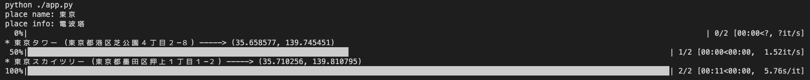
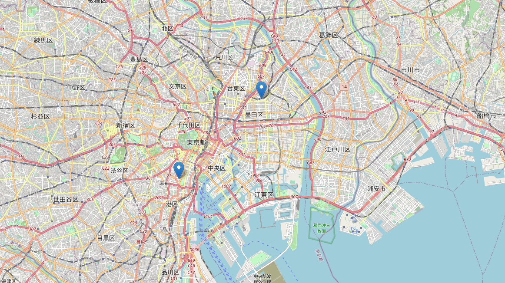

# map-visualization

DB(SQLite)内の住所データをGeocodingして地図にプロットする。




## 利用サービス

- [Geocoding API - 住所から緯度経度を検索](https://www.geocoding.jp/api/)
  - APIコールは、10秒に1回に抑える必要がある

## 利用ライブラリ

- 地図データ可視化に使用
  - [folium](https://github.com/python-visualization/folium)
    - [foliumの基本的な使い方とオープンデータ活用 - Qiita](https://qiita.com/Kumanuron-1910/items/12ce7aa02922927de2f4)
  - pandas
- Geocoding APIコール、解析に使用
  - requests
  - beautifulsoup4
  - lxml
- プログレスバー表示に使用
  - tqdm

## 開発環境

| ツール種類 | ツール名 |
|--|--|
| 依存関係管理 | [Poetry](https://python-poetry.org/) |
| テストフレームワーク | [pytest](https://docs.pytest.org/en/6.2.x/) |
| リンター | [flake8](https://flake8.pycqa.org/en/latest/) |
| フォーマッター | [black](https://github.com/psf/black) |
| 型チェック | [mypy](https://mypy.readthedocs.io/en/stable/) |

## 実行方法

```sh
python ./app.py
# もしくは
make start
```

- プロジェクトディレクトリの`places_test.db`を読み込む
- 地図を`map.html`として出力

## 開発方法

### [Poetry](https://cocoatomo.github.io/poetry-ja/basic-usage/)導入

開発環境に無ければ入れる。使い方まとめは[こちら](https://github.com/mozkzki/poetry-sample/blob/main/README.md)。

#### Mac / Linux

```bash
> curl -sSL https://raw.githubusercontent.com/python-poetry/poetry/master/get-poetry.py | python
```

#### Windows (※Powershellで導入)

```Powershll
> (Invoke-WebRequest -Uri https://raw.githubusercontent.com/python-poetry/poetry/master/get-poetry.py -UseBasicParsing).Content | python
```

### 依存パッケージの一括インストール

```sh
poetry install
```

### 仮想環境に入る

lintやunit testは仮想環境に入って実行する。出るのは`exit`。

```sh
poetry shell
```

### とりあえず一通り動確したい時

```sh
make lint
make ut
make start
```

### Unit Test

全部実行

```sh
pytest
pytest -v # verbose
pytest -s # 標準出力を出す (--capture=noと同じ)
pytest -ra # サマリーを表示 (テストをpassしたもの以外)
pytest -rA # サマリーを表示 (テストをpassしたものも含む)
```

指定して実行  
(テストファイル名, パッケージ名, テストクラス名, メソッド名, 割と何でも拾ってくれる。部分一致でも。)

```sh
pytest -k app
pytest -k test_app.py
pytest -k my
```

マーカーを指定して実行

```sh
pytest -m 'slow'
pytest -m 'not slow'
```

カバレッジレポートも作成

```sh
pytest -v --capture=no --cov-config .coveragerc --cov=main --cov-report=xml --cov-report=term-missing .
```

もしくは

```sh
make ut
```

VSCodeでコードカバレッジを見るには、Coverage Gutters (プラグイン) を入れる。表示されない場合は、コマンドパレットで`Coverage Gutters: Display Coverage`する。

- [VSCodeでカバレッジを表示する（pytest-cov）](https://zenn.dev/tyoyo/articles/769df4b7eb9398)

### Lint

```sh
flake8 --max-line-length=100 --ignore=E203,W503 ./main
```

もしくは

```sh
make lint
```

## 参考

- [基本的な使い方 - Poetry documentation (ver. 1.1.6 日本語訳)](https://cocoatomo.github.io/poetry-ja/basic-usage/)
- [Configuration — pytest documentation](https://docs.pytest.org/en/6.2.x/customize.html)
- [Usage and Invocations — pytest documentation](https://docs.pytest.org/en/6.2.x/usage.html)
